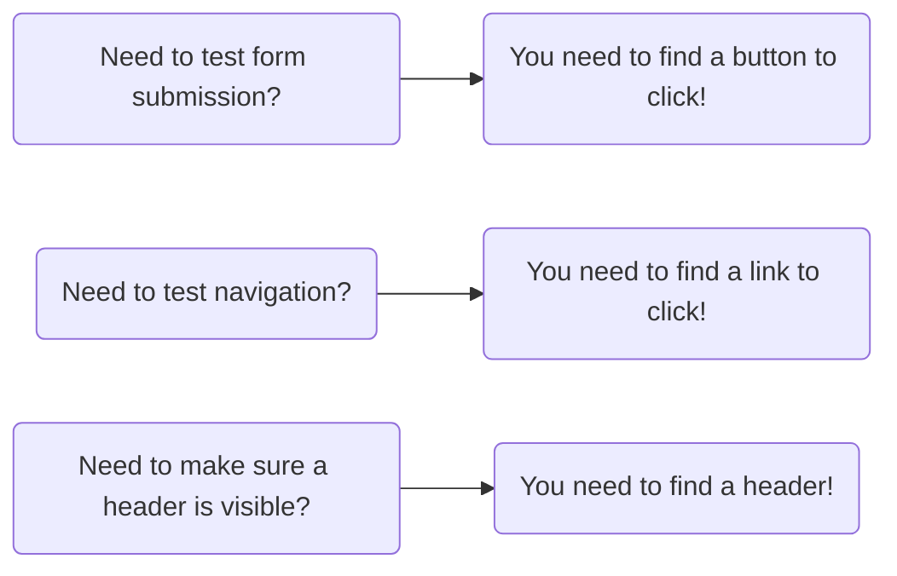

# React Testing document!

| Library                       | Purpose                                                  |
| ----------------------------- | -------------------------------------------------------- |
| `@testing-library/react`      | 'Uses ReactDOM to render a component for testing'        |
| `@testing-library/user-event` | "Helps simulate user input like typing and clicking"     |
| `@testing-library/dom`        | 'Helps find elements that are rendered by our components |
| `jest`                        | 'Runs our tests, reports results'                        |
| `js/dom`                      | ''Simulates a browser when running in a Node environment |

## Test parts

- render the component
- manipulate the component or find an element in it
- Assertion - make sure the component is doing what we expect it to do

# Queries

A **super** important part of testing is finding the elements that our component has created



## React Testing Library Query System

There is a collection of ~48 functions that are used to find elements

Below are some of the query functions

|                         | Partial List                   |                           |
| ----------------------- | ------------------------------ | ------------------------- |
| screen.getByRole()      | screen.findAllByDisplayValue() | screen.queryAllByRole()   |
| screen.queryByRole()    | screen.findByRole()            | screen.queryByLabelText() |
| screen.findAllByTitle() | screen.findByTitle()           | screen.getByLabelText()   |

## ARIA Role

- The Role we are referring in some queries is the **ARIA** Role
- ARIA Roles clarify the **purpose** of an HTML element
- Traditionally used by screen readers - softwares to help people understand the content of the screen
- Many HTML elements have an 'implicit', or automatically assigned role
- Elements can be manually assigned a role. (usually not done)

### Many HTML elements have automatic or implicit roles assigned to them

| ARIA Role | Automatically applied to these HTML elements |
| --------- | -------------------------------------------- |
| heading   | h1, h2, ..h6                                 |
| list      | li, ul                                       |
| button    | button                                       |
| link      | a                                            |
| textbox   | input, type='text'                           |

Full list here -

- [ARIA Roles](https://www.w3.org/TR/html-aria/#docconformance)

## Assertions

Assertions are where we are going to make sure that our component is doing exactly what we expect.

Whenever we want to make an assertion, we're going to use the expect function.

Expect is provided by the just testing framework.

It is a global variable, so that means we do not need to import it or anything like that.

```sh
expect(screen.getByRole('button')).toBeInTheDocument();
```

### Matcher

Whenever we call expect, we are always going to pass in some value right here.
We're then going to chain on a function that we refer to as a matcher.

A matcher is going to take a look at the value we passed in and make sure that some property or attribute of it is equal to maybe something we provide or just make sure that the value we provided is present in the document or exists or any of a variety of different checks.

- [Matchers from Jest](https://jestjs.io/docs/expect)
- [Matchers from React Testing Library](https://github.com/testing-library/jest-dom#custom-matchers)

### Matchers from Jest

```mermaid

[Need to test form submission?] --> [You need to find a button to click!]

```
