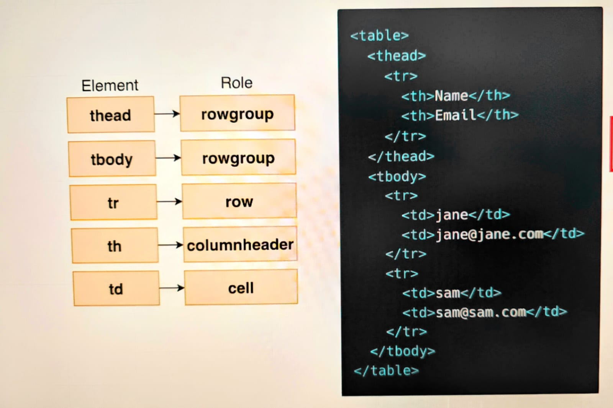

# React Testing Library!

The below guide will help anyone new to react testing.

It briefs over the important concepts of react testing.

The end goal of this guide is that any new developer who has no experience with React testing should be able to write basic react tests.

| Library                      | Docs                                                                   | Purpose                                                  |
| ---------------------------- | ---------------------------------------------------------------------- | -------------------------------------------------------- |
| React                        | [docs](https://react.dev/learn/)                                       |                                                          |
| React API                    | [docs](https://react.dev/reference/react/hooks/)                       |                                                          |
| @testing-library/react       | [docs](https://testing-library.com/docs/react-testing-library/intro/)  | Uses ReactDOM to render a component for testing          |
| @testing-library/user-event  | [docs](https://testing-library.com/docs/user-event/intro)              | Helps simulate user input like typing and clicking       |
| @testing-library/dom         | [docs](https://testing-library.com/docs/ecosystem-jest-dom/)           | Helps find elements that are rendered by our components  |
| jest                         | [docs](https://jestjs.io/docs/using-matchers)                          | Simulates a browser when running in a Node environment   |
| @testing-library/react-hooks | [docs](https://github.com/testing-library/react-hooks-testing-library) |
| @testing-library/jest-dom    | [docs](https://github.com/testing-library/jest-dom#custom-matchers)    | Helps find elements that are rendered by our components. |
| expect                       | [docs](https://jestjs.io/docs/expect)                                  | Used for making assertions                               |

## Steps in writing the test

- render the component
- manipulate the component or find an element in it
- Assertion - make sure the component is doing what we expect it to do

# Queries

A **super** important part of testing is finding the elements that our component has created


## React Testing Library Query System

There is a collection of ~48 functions that are used to find elements

Below are some of the query functions

|                         | Partial List                   |                           |
| ----------------------- | ------------------------------ | ------------------------- |
| screen.getByRole()      | screen.findAllByDisplayValue() | screen.queryAllByRole()   |
| screen.queryByRole()    | screen.findByRole()            | screen.queryByLabelText() |
| screen.findAllByTitle() | screen.findByTitle()           | screen.getByLabelText()   |

## ARIA Role

- The Role we are referring in some queries is the **ARIA** Role
- ARIA Roles clarify the **purpose** of an HTML element
- Traditionally used by screen readers - softwares to help people understand the content of the screen
- Many HTML elements have an 'implicit', or automatically assigned role
- Elements can be manually assigned a role. (usually not done)

### Many HTML elements have automatic or implicit roles assigned to them

| ARIA Role | Automatically applied to these HTML elements |
| --------- | -------------------------------------------- |
| heading   | h1, h2, ..h6                                 |
| list      | li, ul                                       |
| button    | button                                       |
| link      | a                                            |
| textbox   | input, type='text'                           |

Full list here -

- [ARIA Roles](https://www.w3.org/TR/html-aria/#docconformance)

## Assertions

Assertions are where we are going to make sure that our component is doing exactly what we expect.

Whenever we want to make an assertion, we're going to use the expect function.

Expect is provided by the jest testing framework.

It is a global variable, so that means we do not need to import it or anything like that.

```sh
expect(screen.getByRole('button')).toBeInTheDocument();
```

### Matcher

Whenever we call expect, we are always going to pass in some value right here.
We're then going to chain on a function that we refer to as a matcher.

A matcher is going to take a look at the value we passed in and make sure that some property or attribute of it is equal to maybe something we provide or just make sure that the value we provided is present in the document or exists or any of a variety of different checks.

- [Matchers from Jest](https://jestjs.io/docs/expect)
- [Matchers from React Testing Library](https://github.com/testing-library/jest-dom#custom-matchers)

### Matchers from Jest

- expect(['a','b']).toHaveLength(2) -->Makes sure the value is an array with a particular length
- expect(5).toEqual(5) --> Makes sure the value equals another value
- expect(['a','b','c']).toContain('b') --> Makes sure an array contains a value
- expect(fn).toThrow() --> Makes sure a function throws an error when called
- expect(mock).toHaveBeenCalled() --> Makes sure a mock function has been called

### Matchers for RTL (jest-dom)

- expect(element).toBeInTheDocument() --> Makes sure element is present on the page
- expect(element).toBeEnabled() --> Makes sure an element (like an input) is not disabled
- expect(element).toHaveClass() --> Makes sure an element has a class name
- expect(element).toHaveTextContent() --> Makes sure an element has some particular text
- expect(element).toHaveValue() --> Makes sure an input, select, or textarea has value

# Testing Library User - `@testing-library/user-event`

## User Event

When we import the user event library, we get an object called user.

This object has a couple of functions tied to it that allow us to simulate very common user events such as clicking and typing.

```node
import user from '@testing-library/user-event';
```

Example

- user.click(element); -> Simulates clicking on the provided element
- user.keyboard('textValue') -> Simulates typing
- user.keyboard('{Enter}'); -> Simulates pressing the enter key

### @testing-library/user-event: `user.type` vs `user.keyboard`

In the context of `@testing-library/user-event`, `user.type` and `user.keyboard` serve different purposes for simulating user interactions with a web application. Below is an overview of each method and when to use them:

### `user.type`

The `user.type` method is used to simulate typing into input elements (e.g., text inputs, textareas). It provides a high-level abstraction that mimics how a user types text into an input field. This method handles events like `keydown`, `keypress`, `input`, and `keyup`, which are typically triggered when a user types on their keyboard.

### Usage

```javascript
import userEvent from '@testing-library/user-event';
import { render, screen } from '@testing-library/react';
import '@testing-library/jest-dom/extend-expect';
import MyComponent from './MyComponent'; // Replace with your component

test('user types into an input field', () => {
  render(<MyComponent />);
  const input = screen.getByRole('textbox');
  userEvent.type(input, 'Hello, world!');
  expect(input).toHaveValue('Hello, world!');
});
```

### `user.keyboard`

The `user.keyboard` method is used to simulate keyboard interactions, including typing specific keys, key combinations (e.g., Ctrl+C, Shift+Tab), and sequences of key presses. It is more flexible and lower-level than `user.type`, allowing you to simulate complex keyboard interactions that go beyond simple text input.

```javascript
import userEvent from '@testing-library/user-event';
import { render, screen } from '@testing-library/react';
import '@testing-library/jest-dom/extend-expect';
import MyComponent from './MyComponent'; // Replace with your component

test('user navigates with the keyboard', () => {
  render(<MyComponent />);
  const input = screen.getByRole('textbox');
  input.focus();
  userEvent.keyboard('Hello{arrowleft}world{space}');
  expect(input).toHaveValue('Hellworld o');
  expect(input.selectionStart).toBe(7); // Cursor position after 'Hello'
});
```

### Summary

user.type: Use for simple text input into form fields. It's a higher-level abstraction that simplifies simulating user typing.
user.keyboard: Use for more complex keyboard interactions, such as navigating within the text, pressing special keys, or simulating key combinations.

# Jest `jest`

## Mock Functions

Consider we are testing the below component

```Javascript
import { useState } from 'react';

function UserForm({ onUserAdd }) {
  const [email, setEmail] = useState('');
  const [name, setName] = useState('');

  const handleSubmit = (event) => {
    event.preventDefault();

    onUserAdd({ name, email });
  };

  return (
    <form onSubmit={handleSubmit}>
      <div>
        <label htmlFor="name">Name</label>
        <input
          value={name}
          id="name"
          onChange={(e) => setName(e.target.value)}
        />
      </div>
      <div>
        <label htmlFor="email">Email</label>
        <input
          value={email}
          id="email"
          onChange={(e) => setEmail(e.target.value)}
        />
      </div>
      <button>Add User</button>
    </form>
  );
}

export default UserForm;
```

Heres the test case we write for this

```Javascript
test('form is submitted', async () => {

    // Render the component
    render(<UserForm />);

    // Find two inputs
    const [nameInput, emailInput] = screen.getAllByRole('textbox');

    // Simulate typing in a name
    await user.click(nameInput);
    await user.keyboard('Hello{arrowleft}world ');

    // Simulate typing in an email
    await user.click(emailInput);
    await user.keyboard('hello@mail.com');

    // Find the button
    // Simulate clicking the button
    const button = screen.getByRole('button');
    await user.click(button);

    // Assertion to make sure 'onUserAdd' gets called with email/name
  });
```

The above test will fail with the following error:

> TypeError: onUserAdd is not a function
> 8 | event.preventDefault();  
> 9 |
> 10 | onUserAdd({ name, email });
> | ^
> 11 | };

This happens because right now we are not passing onUserAdd in the test to the component. So form submission results to calling `undefined({name, email})`

To fix this we need a proper declaration, now we can declare the function like below.
This works but it **won't be the best implementation**

```javascript
test('it calls onUserAdd when the form is submitted', async () => {
  // ! NOT THE BEST IMPLEMENTATION
  const argList = [];
  const callback = (...args) => {
    argList.push(args);
  };

  // Render the component
  render(<UserForm onUserAdd={callback} />);

  // Find two inputs
  const [nameInput, emailInput] = screen.getAllByRole('textbox');

  // Simulate typing in a name
  await user.click(nameInput);
  await user.keyboard('Hello{arrowleft}world ');

  // Simulate typing in an email
  await user.click(emailInput);
  await user.keyboard('hello@mail.com');

  // Find the button
  // Simulate clicking the button
  const button = screen.getByRole('button');
  await user.click(button);

  // Assertion to make sure 'onUserAdd' gets called with email/name
  expect(argList).toHaveLength(1);
  expect(argList[0][0]).toEqual({
    name: 'Hellworld o',
    email: 'hello@mail.com',
  });
});
```

### What is a mock function?

A mock function is a fake function that doesn't really do anything when it is called.

All it does is record the fact that it got called and also records the arguments that it was called with.

```javascript
const callback = (...args) => {
  argList.push(args);
};
```

So you can think of it as being almost identical to this very simple code that we just put together right here. This is a function that doesn't really do anything when it is called. It just records whatever arguments are received. That's it.

- `mock` means not `not real`
- Fake function that does not do anything
- Records whenever it gets called, and the arguments it was called with
- Used very often when we need to make sure a component calls a callback

```javascript
// -> BETTER IMPLEMENTATION FOR ABOVE TEST
test('calls onUserAdd when the form is submitted', async () => {
  const mock = jest.fn();

  // Render
  render(<UserForm onUserAdd={mock} />);

  // Matchers
  const [nameInput, emailInput] = screen.getAllByRole('textbox');

  await user.click(nameInput);
  await user.keyboard('jane');

  await user.click(emailInput);
  await user.keyboard('jane@mail.com');

  const button = screen.getByRole('button');
  await user.click(button);

  // Assertions
  expect(mock).toHaveBeenCalled();
  expect(mock).toHaveBeenCalledWith({ name: 'jane', email: 'jane@mail.com' });
});
```

# Prefer Roles Over `data-testid`

Using roles with React Testing Library (RTL) is a good practice as it helps to decouple the test logic from the implementation details of the component. By using roles, you can write more resilient tests that are less likely to break when the implementation of the component changes.

> Note: Even though roles are preferred sometimes it might be difficult to query for them. Don't be obsessed and spend only a few mins trying to find the role, else use test id instead.

## 1. Prefer `role` over `testId`

Instead of using specific test IDs (`data-testid`) to access elements, try to use roles whenever possible. Roles allow you to define the purpose of an element within the context of the component, making the tests more meaningful and easier to understand. For example, you might use roles like `button`, `input`, `form`, `heading`, etc.

React Testing Library recommends using roles to select elements over `data-testid` for several reasons:

### User-Centric Testing

Selecting elements by their role encourages testing from the perspective of how a user interacts with the application. This aligns the tests more closely with actual user behavior, ensuring that the elements are accessible and usable in a real-world scenario.

### Accessibility

Roles are an essential part of web accessibility. By selecting elements based on their roles, you implicitly test the accessibility features of your application. This practice helps ensure that your application is usable by people who rely on assistive technologies.

### Maintenance

Tests that rely on `data-testid` attributes can become harder to maintain. The `data-testid` attributes are not part of the user experience and can be removed or changed without affecting functionality. On the other hand, roles are less likely to change, making your tests more stable and resilient to refactoring.

### Reflecting Best Practices

Encouraging the use of roles promotes better coding practices. Developers are more likely to use semantic HTML and ARIA roles correctly, which improves both the accessibility and overall quality of the code.

### Readability

Tests that select elements based on roles tend to be more readable and self-explanatory. They describe what the user is interacting with in a way that is immediately clear, which can make understanding and maintaining tests easier.

### Example

Here’s an example to illustrate the difference:

**Using `data-testid`:**

```jsx
<button data-testid="submit-button">Submit</button>
```

```javascript
const button = getByTestId('submit-button');
```

**Using role:**

```jsx
<button role="button">Submit</button>
```

```javascript
const button = getByRole('button', { name: /submit/i });
```

In the second example, the test not only finds the button but also confirms that it is accessible with the correct label, enhancing both the accessibility and reliability of your tests.

## 2. Use `logRole` for Debugging

If you are unsure about the available roles in a rendered component, React Testing Library provides a helpful method called `logRole`. This method can be used to log all the elements with their respective roles, making it easier to identify and select elements during testing. You can use it like this:

```javascript
import { render, screen } from '@testing-library/react';

test('example test with logRole', () => {
  render(<YourComponent />);
  screen.logRole(); // Log elements with roles to the console
  // …rest of your test logic
});
```

By checking the console output, you will see a list of components and their roles, which can be helpful for selecting elements in your tests.

# Testing-Library/ React

## Debugging

### Testing Playground

Memorizing all the query functions to find elements + roles is hard.

To get help with finding a particular element, use this helper function - `screen.logTestingPlaygroundURL()`

The above function takes the HTML currently rendered by your component and creates a link to view that HTML in the **Testing Playground** tool.
Testing Playground helps you write queries (function to find elements)

So you will get the link of the component in the terminal from where you run the test, and the component is rendered based on the components current state.
For example, below is the component rendered

```javascript
// UserList component
function UserList({ users }) {
  const renderedUsers = users.map((user) => {
    return (
      <tr key={user.name}>
        <td>{user.name}</td>
        <td>{user.email}</td>
      </tr>
    );
  });

  return (
    <table>
      <thead>
        <tr>
          <th>Name</th>
          <th>Email</th>
        </tr>
      </thead>
      <tbody data-testid="users">{renderedUsers}</tbody>
    </table>
  );
}

export default UserList;
```

```javascript
// Test for userlist component
test('renders one row per user', () => {
  // Render the component
  const users = [
    { name: 'john', email: 'john@mail.com' },
    { name: 'jane', email: 'jane@jane.com' },
  ];
  render(<UserList users={users} />);

  screen.logTestingPlaygroundURL();
});
```

When the test is now ran from terminal, notice the console.log of a pretty long URL.

[Testing Playground](https://testing-playground.com/#markup=DwEwlgbgfMAuCGAjANgUxrAFq+IMCcNMoA5eAW1WAHosioBRc+MZGu9w97XDRAexABPAhjwAreADsqtPHAnTUAAWasAdAGN+5dvNpdYhvAGcKesVDPll1rToucYtAcOcIU6GuGhA)

When clicked on this link, it navigates to the page displayed below, and this is the HTML that was produced by our component.


On the right hand side where we see the preview, we can click on the elements manually and when we do that we get the recommendations in the bottom of how we can write out a query function to find that particular element.

**Short Comings**
For the above test, we really want to find the rows and get the number of rows present to make assertion.

But if we try to click on these rows, we would not be able to do so. If you're ever in that scenario, we can use a little bit of a trick. We can add in some custom styling to the HTML right here directly just to add in some additional padding, essentially to make elements easier to click as shown in image below.


Now the test becomes

```javascript
test('renders one row per user', () => {
  // Render the component
  const users = [
    { name: 'jane', email: 'jane@mail.com' },
    { name: 'sam', email: 'sam@sam.com' },
  ];

  render(<UserList users={users} />);

  // screen.logTestingPlaygroundURL();

  // Find all the rows in the table
  const rows = screen.getAllByRole('row');

  // Assertion: correct number of rows in the table
  expect(rows).toHaveLength(2);
});
```

### Using the screen.debug() method

React Testing Library exposes a debug() method from the screen object to print out the state of the DOM.

**Understanding the screen.debug() syntax**

Take a look at the screen.debug() syntax shown below:

```javascript
screen.debug(element, maxLengthToPrint, options);
```

- The first parameter of the debug() method is the element we want the screen.debug() method to print out. This parameter can be a single element or multiple elements. If left undefined, it will default to printing the root node.

- The second parameter lets us specify the content length to print. The default output length is 7000, meaning the content will be truncated after seven thousand characters. We can increase or limit the output length as needed.

- We may also want to configure test formatting using the options parameter. For instance, we can turn off syntax highlighting in the terminal with the options parameter as follows:

```javascript
const messages = document.getElementById('messages');

screen.debug(messages, null, { highlight: false });
```

[Options properties for debug](https://github.com/jestjs/jest/tree/main/packages/pretty-format#usage-with-options)

### Using the screen.logRole() method

Explained above

## Querying Within Elements

> The above test actually **fails** as we get three rows instead of two as there is header row as wel



- Sometimes finding elements by role just doesn't work well
- In these cases we can use two other ways to find elements when the preferred `role` approach does not work
  - data-testid
  - container.querySelector()

**Within** (an alias to getQueriesForElement) takes a DOM element and binds it to the raw query functions, allowing them to be used without specifying a container.

It is the recommended approach for libraries built on this API and is used under the hood in React Testing Library.

[Testing library within](https://testing-library.com/docs/dom-testing-library/api-within/)

```javascript
test('renders one row per user', () => {
  // Render the component
  const users = [
    { name: 'jane', email: 'jane@mail.com' },
    { name: 'sam', email: 'sam@sam.com' },
  ];

  render(<UserList users={users} />);

  // screen.logTestingPlaygroundURL();

  // Find all the rows in the table
  const { getAllByRole } = within(screen.getByTestId('users'));
  const rows = getAllByRole('row');
  // OR
  const rows = within(screen.getByTestId('users')).getAllByRole('row');

  // Assertion: correct number of rows in the table
  expect(rows).toHaveLength(2);
});
```

By using within, you can isolate the scope to table body and then query within that scope.

## Container Query Selector

And when we call render, we're going to get back an object that has a couple of helper properties on it.
One that we're going to use in this case is called container.

Container is a reference to a HTML element that is automatically added into our component.

In the testing playground, you might have noticed that our component that we are currently testing produces a table as its top level element.

Whenever React testing library takes our component and renders it, it's going to add in an additional div element outside or wrapping our component. This is referred to as the container.

```javascript
test('renders one row per user (container.querySelector approach)', () => {
  // Render the component
  const users = [
    { name: 'jane', email: 'jane@mail.com' },
    { name: 'sam', email: 'sam@sam.com' },
  ];

  const { container } = render(<UserList users={users} />);

  // screen.logTestingPlaygroundURL();

  // Find all the rows in the table
  const rows = container.querySelectorAll('tbody tr');

  // Assertion: correct number of rows in the table
  expect(rows).toHaveLength(2);
});
```
